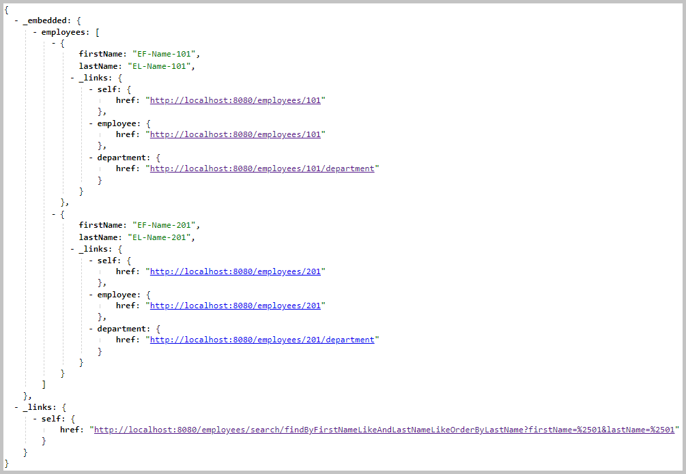

<!DOCTYPE html>
<HTML lang="en">
<META charset="UTF-8">
<BODY>

<H2 id="contents">Study07 README Contents</H2>
<H3 id="top">Research the <a href="https://spring.io/projects/spring-data-rest">Spring Data REST</a> application with the <a href="https://www.h2database.com/">H2 database</a></H3>

 

<I>The flowchart with the SpringBoot application and the H2 database.</I>

<a href="https://spring.io/projects/spring-data-rest">Spring Data REST</a>

<ul>
<li>takes the features of <a href="https://spring.io/projects/spring-hateoas">Spring HATEOAS</a> 
and <a href="https://spring.io/projects/spring-data-jpa">Spring Data JPA</a> 
and automatically combines them</li>
<li>directs <a href="https://docs.spring.io/spring-framework/docs/current/reference/html/web.html">Spring Web MVC</a> 
to create RESTful endpoints</li>
<li>creates the Spring Web MVC controllers</li>
</ul>

The controllers for the <a href="https://github.com/k1729p/Study07/blob/main/src/main/java/kp/company/domain/Department.java">Department</a> 
and the <a href="https://github.com/k1729p/Study07/blob/main/src/main/java/kp/company/domain/Employee.java">Employee</a>
are generated by Spring Data REST . 
The relevant MVC context hierarchy diagram is on page
<a href="https://docs.spring.io/spring-framework/reference/web/webmvc/mvc-servlet/context-hierarchy.html">Spring Web MVC</a>. 
The generation process uses customizations from the
<a href="https://github.com/k1729p/Study07/blob/main/src/main/java/kp/company/repository/DepartmentRepository.java">DepartmentRepository</a> 
and the 
<a href="https://github.com/k1729p/Study07/blob/main/src/main/java/kp/company/repository/EmployeeRepository.java">EmployeeRepository</a>. 
The helper controller <a href="https://github.com/k1729p/Study07/blob/main/src/main/java/kp/company/controller/SampleDatasetLoaderController.java">
SampleDatasetLoaderController</a> is used only for loading the sample dataset.

The sections of this project:

<OL>
<LI><a href="#ONE"><b>SpringBoot Server</b></a></LI>
<LI><a href="#TWO"><b>Web Browser Client</b></a></LI>
<LI><a href="#THREE"><b>Curl Client</b></a></LI>
</OL>

Java source code. Packages: 
 

    <i>application sources</i>&nbsp;:&nbsp;
	<a href="https://github.com/k1729p/Study07/tree/main/src/main/java/kp">kp</a> 

    <i>test sources</i>&nbsp;:&nbsp;
	<a href="https://github.com/k1729p/Study07/tree/main/src/test/java/kp">kp</a> 

 

<I>The domain objects class diagram.</I>

 

    <a href="http://htmlpreview.github.io/?https://github.com/k1729p/Study07/blob/main/docs/apidocs/index.html">
	Java API Documentation</a>&nbsp;●&nbsp;
    <a href="http://htmlpreview.github.io/?https://github.com/k1729p/Study07/blob/main/docs/testapidocs/index.html">
	Java Test API Documentation</a> 

<H3 id="ONE">❶ SpringBoot Server</H3>

Action: 
 
 1. With batch file 
<a href="https://github.com/k1729p/Study07/blob/main/0_batch/01%20MVN%20clean%20install%20run.bat"> 
<I>"01 MVN clean install run.bat"</I></a> build and start the SpringBoot Server. 

<a href="#top">Back to the top of the page</a>

<H3 id="TWO">❷ Web Browser Client</H3>

Action: 
 
 1. With the URL <a href="http://localhost:8080">http://localhost:8080</a> 
open in the web browser the '<i>home page</i>'. 
 2. Loading standard dataset with 2 departments. On this '<i>home page</i>' select 
'<i>Load sample dataset : 2 departments</i>' 
<a href="http://localhost:8080/loadSampleDataset">http://localhost:8080/loadSampleDataset</a>. 
 3. Two endpoints need to load a bigger dataset with 15 departments. On this '<i>home page</i>' select 
'<i>Load sample dataset : 15 departments</i>' 
<a href="http://localhost:8080/loadSampleDataset?depIndex=15">http://localhost:8080/loadSampleDataset?depIndex=15</a>. 

 
2.1. The '<i>home page</i>' file <b>index.html</b>: 
<a href="https://github.com/k1729p/Study07/blob/main/src/main/resources/static/index.html">HTML code</a>, 
<a href="http://htmlpreview.github.io/?https://github.com/k1729p/Study07/blob/main/src/main/resources/static/index.html">
HTML preview</a>

 

<I>The screenshot of the home page.</I>

 
2.2. The endpoints generated for 
<a href="https://github.com/k1729p/Study07/blob/main/src/main/java/kp/company/domain/Department.java">Department</a>
and selected from the default set.

2.2.1. Get all <b>departments</b>: 
<a href="http://localhost:8080/departments">/departments</a>

 

<I>The result from the endpoint 'Get all <b>departments</b>'.</I>

2.2.2. Get all <b>departments</b> on 3rd page: 
<a href="http://localhost:8080/departments?page=2&size=3&sort=name,asc">/departments?page=2&size=3&sort=name,asc</a> 
This endpoint requires loading a bigger dataset with 15 departments.

 

<I>The result from the endpoint 'Get all <b>departments</b> on 3rd page'.</I>

2.2.3. Get the <b>department</b>:
<a href="http://localhost:8080/departments/1">/departments/1</a>

 

<I>The result from the endpoint 'Get the <b>department</b>'.</I>

2.2.4. Get the <b>employees</b> of the department: 
<a href="http://localhost:8080/departments/1/employees">/departments/1/employees</a>

 

<I>The result from the endpoint 'Get the <b>employees</b> of the department'.</I>

 
2.3. The endpoints generated for 
<a href="https://github.com/k1729p/Study07/blob/main/src/main/java/kp/company/domain/Department.java">Department</a> and  based on the interface 
<a href="https://github.com/k1729p/Study07/blob/main/src/main/java/kp/company/repository/DepartmentRepository.java">DepartmentRepository</a>.
 
The <a href="images/DepartmentsSearchLinks.png">
<b>screenshot</b></a> of the result from the <i>_links</i> endpoint <a href="http://localhost:8080/departments/search">/departments/search</a>

2.3.1. Find all <b>departments</b> on 3rd slice: 
<a href="http://localhost:8080/departments/search/findAllByOrderByName?page=2&amp;size=3&amp;sort=name,asc">/departments/search/findAllByOrderByName?page=2&amp;size=3&amp;sort=name,asc</a> 
This endpoint requires loading a bigger dataset with 15 departments. 
The method exposed on the repository: 
<a href="https://github.com/k1729p/Study07/blob/main/src/main/java/kp/company/repository/DepartmentRepository.java#L32">
kp.company.repository.DepartmentRepository::findAllByOrderByName</a>.

 

<I>The result from the endpoint 'Find all <b>departments</b> on 3rd slice'.</I>

2.3.2. Find <b>departments</b> by name: 
<a href="http://localhost:8080/departments/search/findByName?name=D-Name-01">/departments/search/findByName?name=D-Name-01</a> 
The method exposed on the repository: 
<a href="https://github.com/k1729p/Study07/blob/main/src/main/java/kp/company/repository/DepartmentRepository.java#L40">
kp.company.repository.DepartmentRepository::findByName</a>.

 

<I>The result from the endpoint 'Find <b>departments</b> by name'.</I>

2.3.3. Count <b>departments</b> by name: 
<a href="http://localhost:8080/departments/search/countByName?name=D-Name-01">/departments/search/countByName?name=D-Name-01</a> 
The method exposed on the repository: 
<a href="https://github.com/k1729p/Study07/blob/main/src/main/java/kp/company/repository/DepartmentRepository.java#L48">
kp.company.repository.DepartmentRepository::countByName</a>.

 

<I>The result from the endpoint 'Count <b>departments</b> by name'.</I>

2.3.4. Count <b>employees</b> in the department with id: 
<a href="http://localhost:8080/departments/search/countByCustomQuery?id=1">/departments/search/countByCustomQuery?id=1</a> 
The method exposed on the repository: 
<a href="https://github.com/k1729p/Study07/blob/main/src/main/java/kp/company/repository/DepartmentRepository.java#L60">
kp.company.repository.DepartmentRepository::countByCustomQuery</a>. 
This method has the annotation with SQL query, and it returns
<a href="https://github.com/k1729p/Study07/blob/main/src/main/java/kp/company/domain/DepartmentDto.java">DepartmentDto</a> object.

 

<I>The result from the endpoint 'Count <b>employees</b> in the department with id'.</I>

2.3.5. Delete <b>departments</b> by name: 
<a href="http://localhost:8080/departments/search/deleteByName?name=D-Name-01">/departments/search/deleteByName?name=D-Name-01</a> 
The method exposed on the repository: 
<a href="https://github.com/k1729p/Study07/blob/main/src/main/java/kp/company/repository/DepartmentRepository.java#L69">
kp.company.repository.DepartmentRepository::deleteByName</a>.

 

<I>The result from the endpoint 'Delete <b>departments</b> by name'.</I>

 
2.4. The endpoints generated for 
<a href="https://github.com/k1729p/Study07/blob/main/src/main/java/kp/company/domain/Employee.java">Employee</a>
and selected from the default set.

2.4.1. Get all <b>employees</b>: 
<a href="http://localhost:8080/employees">/employees</a>

 

<I>The result from the endpoint 'Get all <b>employees</b>'.</I>

2.4.2. Get the <b>employee</b>: 
<a href="http://localhost:8080/employees/101">/employees/101</a>

 

<I>The result from the endpoint 'Get the <b>employee</b>'.</I>

2.4.3. Get the <b>department</b> of the employee: 
<a href="http://localhost:8080/employees/101/department">/employees/101/department</a>

 

<I>The result from the endpoint 'Get the <b>department</b> of the employee'.</I>

 
2.5. The endpoints generated for 
<a href="https://github.com/k1729p/Study07/blob/main/src/main/java/kp/company/domain/Employee.java">Employee</a> and  based on interface 
<a href="https://github.com/k1729p/Study07/blob/main/src/main/java/kp/company/repository/EmployeeRepository.java">EmployeeRepository</a>
 
The <a href="images/EmployeesSearchLinks.png">
<b>screenshot</b></a> of the result from the <i>_links</i> endpoint <a href="http://localhost:8080/employees/search">/employees/search</a>

2.5.1. Find <b>employees</b> by first name and last name: 
<a href="http://localhost:8080/employees/search/findByFirstNameAndLastNameOrderByLastName?firstName=EF-Name-101&amp;lastName=EL-Name-101">/employees/search/findByFirstNameAndLastNameOrderByLastName?firstName=EF-Name-101&amp;lastName=EL-Name-101</a> 
The method exposed on the repository: 
<a href="https://github.com/k1729p/Study07/blob/main/src/main/java/kp/company/repository/EmployeeRepository.java#L26">
kp.company.repository.EmployeeRepository::findByFirstNameAndLastNameOrderByLastName</a>.

 

<I>The result from the endpoint 'Find <b>employees</b> by first name and last name'.</I>

2.5.2. Find <b>employees</b> by first name and last name using 'LIKE' pattern: 
<a href="http://localhost:8080/employees/search/findByFirstNameLikeAndLastNameLikeOrderByLastName?firstName=%2501&amp;lastName=%2501">/employees/search/findByFirstNameLikeAndLastNameLikeOrderByLastName?firstName=%01&amp;lastName=%01</a> 
The method exposed on the repository: 
<a href="https://github.com/k1729p/Study07/blob/main/src/main/java/kp/company/repository/EmployeeRepository.java#L37">
kp.company.repository.EmployeeRepository::findByFirstNameLikeAndLastNameLikeOrderByLastName</a>.

 

<I>The result from the endpoint 'Find <b>employees</b> by first name and last name using 'LIKE' pattern'.</I>

2.5.3. Find <b>employees</b> by department name: 
<a href="http://localhost:8080/employees/search/findByDepartmentNameOrderByLastNameDesc?name=D-Name-01">/employees/search/findByDepartmentNameOrderByLastNameDesc?name=D-Name-01</a> 
The method exposed on the repository: 
<a href="https://github.com/k1729p/Study07/blob/main/src/main/java/kp/company/repository/EmployeeRepository.java#L47">
kp.company.repository.EmployeeRepository::findByDepartmentNameOrderByLastNameDesc</a>.

 

<I>The result from the endpoint 'Find <b>employees</b> by department name'.</I>

 2.6. The Application-Level Profile Semantics (ALPS) links

<ul>
<li>The <a href="images/Profile.png">
<b>screenshot</b></a> of the result from the endpoint <a href="http://localhost:8080/profile">/profile</a></li>

<li>The <a href="images/ProfileDepartments.png">
<b>screenshot</b></a> of the result from the endpoint <a href="http://localhost:8080/profile/departments">/profile/departments</a></li>

<li>The <a href="images/ProfileEmployees.png">
<b>screenshot</b></a> of the result from the endpoint <a href="http://localhost:8080/profile/employees">/profile/employees</a></li>
</ul>

2.7. The <a href="https://docs.spring.io/spring-boot/docs/current/reference/html/actuator.html">Spring Boot Actuator</a> 
creates the endpoints for monitoring and managing the application. 
The <a href="images/ScreenshotListOfActuatorEndpoints.png">
<b>screenshot</b></a> of "<i>List of actuator endpoints</i>" link. 

<a href="#top">Back to the top of the page</a>

<H3 id="THREE">❸ Curl Client</H3>

Action: 
 
 1. With batch file
 <a href="https://github.com/k1729p/Study07/blob/main/0_batch/02%20CURL%20CRUD.bat">
 <I>"02 CURL CRUD.bat"</I></a> create, read, update, and delete departments and employees. 
 2. With batch file
 <a href="https://github.com/k1729p/Study07/blob/main/0_batch/03%20CURL%20load%20and%20read.bat">
 <I>"03 CURL load and read.bat"</I></a> load the sample dataset and get departments and employees. 
 

3.1. The console log screenshots from the run of the batch file "02 CURL CRUD.bat". 
3.1.1. The <a href="images/ScreenshotCurlCrudCreate.png">
<b>screenshot</b></a> of "<i>CREATE</i>" and "<i>READ by id - after CREATE</i>" steps. 
3.1.2. The <a href="images/ScreenshotCurlCrudUpdateWithPut.png">
<b>screenshot</b></a> of "<i>UPDATE with PUT by id</i>" and "<i>READ by id - after UPDATE with PUT</i>" steps. 
The '<i>PUT</i>' replaces an entire record. Fields not supplied are replaced with null. 
3.1.3. The <a href="images/ScreenshotCurlCrudUpdateWithPatch.png">
<b>screenshot</b></a> of "<i>UPDATE with PATCH by id</i>" and "<i>READ by id - after UPDATE with PATCH</i>" steps. 
The '<i>PATCH</i>' updates a subset of items. 
3.1.4. The <a href="images/ScreenshotCurlCrudDelete.png">
<b>screenshot</b></a> of "<i>DELETE by id</i>" and "<i>READ by id - after DELETE</i>" steps.

3.2. The console log screenshots from the run of the batch file "03 CURL load and read.bat". 
3.2.1. The <a href="images/ScreenshotCurlLoadSampleDataset.png">
<b>screenshot</b></a> of "<i>Load sample dataset</i>" step. 
3.2.2. The <a href="images/ScreenshotCurlGetOne.png">
<b>screenshot</b></a> of "<i>GET one department</i>" and "<i>GET one employee</i>" steps. 
3.2.3. The <a href="images/ScreenshotCurlGetAll.png">
<b>screenshot</b></a> of "<i>GET all departments</i>" and "<i>GET all employees</i>" step. 

<a href="#top">Back to the top of the page</a>

<h3>Dictionary</h3>
<table style="border:solid">
<tbody>
<tr><td style="border:solid"><b>ALPS</b></td><td style="border:solid">Application-Level Profile Semantics</td></tr>
<tr><td style="border:solid"><b>HAL</b></td><td style="border:solid">Hypertext Application Language</td></tr>
<tr><td style="border:solid"><b>HATEOAS</b></td><td style="border:solid">Hypermedia As The Engine Of Application State</td></tr>
<tr><td style="border:solid"><b>REST</b></td><td style="border:solid">Representational State Transfer</td></tr>
</tbody>
</table>
<a href="#top">Back to the top of the page</a>
</BODY>
</HTML>