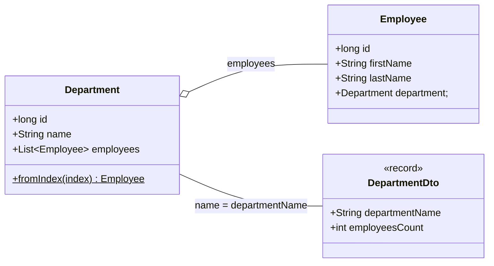

```mermaid
classDiagram
direction RL
class Department {
 +long id
 +String name
 +List~Employee~ employees
 +fromIndex(index)$ Employee
}
class Employee {
 +long id
 +String firstName
 +String lastName
 +Department department;
}
class DepartmentDto {
 <<record>>
 +String departmentName
 +int employeesCount
}

Employee --o Department  : employees
DepartmentDto -- Department : name = departmentName
```