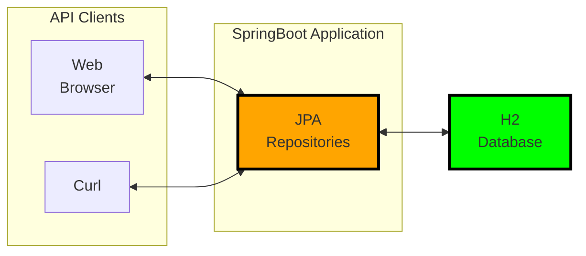

```mermaid
flowchart LR
 subgraph SpringBoot Application
  REP[JPA\nRepositories]
 end
 HDB[H2\nDatabase]
 subgraph API Clients
  WBR[Web\nBrowser]
  CURL[Curl]
 end

 WBR <--> REP:::orangeBox
 CURL <--> REP
 REP <--> HDB:::greenBox
 
 classDef greenBox   fill:#00ff00,stroke:#000,stroke-width:3px
 classDef orangeBox  fill:#ffa500,stroke:#000,stroke-width:3px
```